### .NET Backend Developer

Building robust RESTful APIs and turning business workflows into clean, maintainable backend solutions.

  
  

---

## 👨‍💻 About Me

I'm a .NET Backend Developer focused on building RESTful APIs with C# and ASP.NET Core.

My approach starts with the business workflow: understanding its rules and data, then translating them into practical backend solutions. My Business Information Systems background helps me connect business requirements with backend implementation.

I care about clean architecture, readable code, validation, security, reliable data handling, and backend systems that are easier to maintain as they grow.

---

## 🛠️ Technical Stack

### Backend & Frameworks

### Architecture & Design

### Data & Caching

### Security & Reliability

### Tools & Workflow

---

## 🎓 Background

**B.Sc. in Business Information Systems (BIS)**  
Faculty of Commerce and Business Administration, Helwan University  
Cairo, Egypt

---

## 🌍 Languages

- Arabic — Native
- English — B1
- Spanish — A2

---

### Let’s build something solid 🚀

